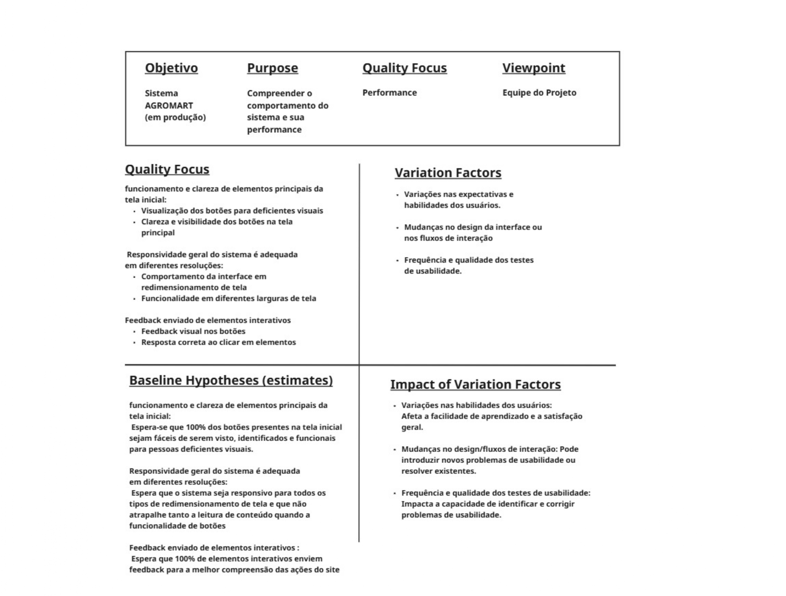
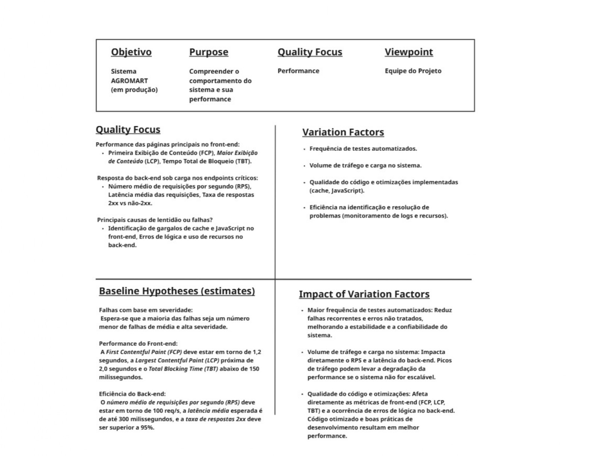

# FASE 2

## Especificação da Avaliação

### Seleção de métricas

Para o processo de seleção de métricas, utilizamos a metodologia GQM, que a partir dele conseguimos definir nossos objetivos, transformando-os em questões, gerando hipóteses e identificando métricas para avaliar com um propósito certo.

Com isso, separamos as métricas para a Performance e Usabilidade.

### Performance

**Question**:

1. Qual a performance das páginas principais no front-end?

**Objetivo**: Avaliar a experiência percebida pelo usuário em termos de tempo de carregamento e interatividade.

**Metrics**
*   **First Contentful Paint (FCP)**
    Mede o tempo até que o primeiro conteúdo visível da página seja exibido. Avalia o quão rápido o usuário percebe que algo começou a carregar.
    Indicador direto da primeira impressão de performance.
*   **Largest Contentful Paint (LCP)**
    Tempo até que o maior elemento visível (como uma imagem ou bloco de texto) seja renderizado.
    Importante para entender quando o conteúdo principal está visível.
*   **Total Blocking Time (TBT)**
    Mede o tempo em que a thread principal do navegador está bloqueada, impedindo interações.
    Essencial para avaliar a fluidez e capacidade de resposta da interface.

**Question**:
2. Como o back-end responde sob carga nos endpoints críticos?

**Objetivo**: Verificar a capacidade do sistema de lidar com múltiplos acessos simultâneos e manter estabilidade sob demanda.

**Metrics**
*   **Número médio de requisições por segundo (RPS)**
    Mede quantas requisições o servidor consegue processar por segundo.
    Indicador de escalabilidade e capacidade de carga.
*   **Latência média das requisições**
    Tempo médio de resposta do servidor a uma requisição.
    Reflete a agilidade do sistema em entregar dados e processar comandos.
*   **Taxa de respostas 2xx vs não-2xx**
    Proporção entre respostas bem-sucedidas (códigos HTTP 2xx) e respostas com erro (4xx, 5xx).
    Mede a estabilidade e confiabilidade do sistema.

**Question**:
3. Quais são as principais causas de lentidão ou falhas?

**Objetivo**: Identificar gargalos técnicos e problemas estruturais que afetam a performance e a confiabilidade do sistema.

**Metrics**
*   **Identificação de gargalos de cache e JavaScript no front-end**
    Avalia se há scripts não utilizados, mal otimizados ou má configuração de cache que atrasam o carregamento da página.
    Essencial para detectar ineficiências no código do front-end.
*   **Erros de lógica e uso ineficiente de recursos no back-end**
    Monitora logs de erro, consumo de CPU/memória e outras anomalias que indicam falhas no código ou má utilização da infraestrutura.
    Ajuda a localizar causas de lentidão, falhas ou quedas do sistema.

### Usabilidade

- **Goal**: Avaliar a usabilidade do sistema Agromart.
- **Questions**:
  - Os elementos principais da tela inicial são funcionais e claros?
  - A responsividade geral do sistema é adequada em diferentes resoluções?
  - Os elementos interativos fornecem feedback visual ou funcional adequado?
- **Metrics**:
  - **Q1: Os elementos principais da tela inicial são funcionais e claros?**
    - M1: Visualização dos botões para deficientes visuais
    - M2: Clareza e visibilidade dos botões na tela principal
  - **Q2: A responsividade geral do sistema é adequada em diferentes resoluções?**
    - M3: Comportamento da interface em redimensionamento de tela
    - M4: Funcionalidade em diferentes larguras de tela
  - **Q3: Os elementos interativos fornecem feedback visual ou funcional adequado?**
    - M4: Feedback visual nos botões
    - M5: Resposta correta ao clicar em elementos

#### Especificação de cada métrica de Usabilidade
- **M1**: Esta métrica avalia se os botões da tela principal estão acessíveis a usuários com deficiência visual, considerando aspectos como contraste adequado, suporte a leitores de tela e presença de textos alternativos.
- **M2**: Esta métrica examina se os botões visíveis na interface são facilmente identificáveis e compreensíveis para o público geral.
- **M3**: Esta métrica avalia como a interface do usuário (UI) se reorganiza e se adapta quando a janela do navegador é redimensionada. Uma UI responsiva mantém a legibilidade, evitando sobreposições, cortes de conteúdo, melhorando a Operabilidade e Compreensibilidade (subcaracterística de Usabilidade ISO 25010).
- **M4**: Esta métrica avalia se as funcionalidades essenciais da aplicação web continuam funcionando corretamente durante o redimensionamento da janela do navegador.
- **M5**: Esta métrica avalia se os botões fornecem um feedback visual claro quando clicados e se as notificações estão sendo exibidas. O feedback visual é essencial para que o usuário saiba que sua ação foi registrada e qual o seu status, melhorando a operabilidade (subcaracterística de Usabilidade ISO 25010).
- **M6**: Esta métrica verifica se ao clicar em qualquer elemento interativo (botões, links, campos de formulário), a ação esperada realmente ocorra sem erros. Isso inclui a navegação para a página correta, o envio de dados e etc.

### Estabelecer níveis de pontuação para as métricas

#### Performance

| Métrica | Níveis de Pontuação |
|---|---|
| First Contentful Paint (FCP) | **Excelente**: FCP <= 1.8 segundos, indicando um carregamento quase instantâneo da página. **Satisfatório**: FCP entre 1.8 e 3.0 segundos, um carregamento perceptível, mas ainda aceitável. **Insatisfatório**: FCP > 3.0 segundos, resultando em uma demora significativa e uma má impressão inicial para o usuário. |
| Largest Contentful Paint (LCP) | **Excelente**: LCP <= 2.5 segundos, indicando que o conteúdo principal da página carrega rapidamente, proporcionando uma boa experiência ao usuário. **Satisfatório**: LCP entre 2.5 e 4.0 segundos, onde o carregamento do conteúdo principal é aceitável, mas pode ser otimizado para uma melhor experiência. **Insatisfatório**: LCP > 4.0 segundos, resultando em uma lentidão significativa para o carregamento do conteúdo principal, o que pode causar frustração e abandono da página por parte do usuário. |
| Total Blocking Time (TBT) | **Excelente**: TBT < 200 milissegundos, indicando uma página altamente interativa e com resposta rápida às ações do usuário. **Satisfatório**: TBT entre 200 e 600 milissegundos, onde a interatividade pode ter um leve atraso, mas a experiência geral não é significativamente comprometida. **Insatisfatório**: TBT > 600 milissegundos, fazendo com que a página pareça lenta ou travada, com atrasos notáveis nas interações do usuário, prejudicando a usabilidade. |
| Número médio de requisições por segundo (RPS) | **Excelente**: O sistema suporta um volume de requisições por segundo significativamente acima do esperado (RPS ≥ [Valor Alvo Alto]), demonstrando alta escalabilidade. **Satisfatório**: O sistema suporta a carga esperada ([Valor Alvo Baixo] ≤ RPS < [Valor Alvo Alto]), mas possui pouca margem para picos de tráfego. **Insatisfatório**: O sistema não suporta a carga esperada (RPS < [Valor Alvo Baixo]), indicando gargalos de desempenho e risco de indisponibilidade |
| Latência média das requisições | **Excelente**: Latência Média <= 200 milissegundos, indicando respostas muito rápidas e uma experiência de usuário fluida. **Satisfatório**: Latência Média entre 200 e 500 milissegundos, com respostas de velocidade aceitável para a maioria das interações. **Insatisfatório**: Latência Média >= 500 milissegundos, resultando em lentidão perceptível que pode frustrar o usuário e prejudicar a usabilidade. |
| Taxa de respostas 2xx vs não-2xx | **Excelente**: Taxa de Sucesso igual ou superior a 99.9%, indicando um sistema altamente estável e confiável com uma taxa de erro mínima. **Satisfatório**: Taxa de Sucesso entre 99% e 99.9%, mostrando um sistema geralmente estável, mas com uma taxa de erro que pode ser investigada e melhorada. **Insatisfatório**: Taxa de Sucesso inferior a 99%, o que aponta para uma taxa de erro significativa e problemas de estabilidade e confiabilidade no back-end, impactando a funcionalidade. |
| Identificação de gargalos de cache e JavaScript no front-end | **Excelente**: Gargalos de performance são proativamente identificados e otimizados com o uso de ferramentas de análise, e as melhores práticas de cache e otimização de JavaScript são consistentemente aplicadas. **Satisfatório**: Gargalos são identificados reativamente, após relatos de lentidão, e as otimizações são realizadas, mas sem uma abordagem sistemática. **Insatisfatório**: Não existe um processo para identificar ou otimizar gargalos de performance no front-end, resultando em lentidão recorrente e não tratada. |
| Erros de lógica e uso de recursos no back-end | **Excelente**: Logs de erro e métricas de recursos são monitorados continuamente com alertas para anomalias. Erros são corrigidos rapidamente, e o uso de recursos é otimizado. **Satisfatório**: Logs de erro são verificados periodicamente, e problemas de recursos são investigados somente após falhas visíveis. **Insatisfatório**: Não há monitoramento de erros ou de uso de recursos, resultando em falhas frequentes e dificuldade em identificar a causa-raiz. |

#### Usabilidade

| Métrica | Níveis de Pontuação |
|---|---|
| Visualização dos botões para deficientes visuais | **Excelente**: Todos os botões e elementos interativos possuem contraste de cor adequado em relação ao plano de fundo, são acompanhados por texto alternativo para leitores de tela e são facilmente navegáveis e ativáveis por meio de teclado. O foco visual é evidente ao navegar com o teclado, e não há dependência exclusiva de cores para transmitir informações importantes. **Satisfatório**: A maioria dos botões possui contraste aceitável e texto alternativo, permitindo alguma navegação por leitores de tela. No entanto, podem haver pequenos problemas, como contraste em alguns elementos, texto alternativo genérico em certos casos, ou uma navegação por teclado que não é totalmente fluida em todas as partes da interface. **Insatisfatório**: Os botões e elementos interativos estão sem o contraste adequado, tornando difíceis de serem distinguidos por usuários com baixa visão. Não há texto alternativo ou o texto é inadequado, impossibilitando a compreensão por leitores de tela. A navegação por teclado é inexistente ou extremamente difícil, e as informações importantes são transmitidas apenas por cor, excluindo usuários daltônicos ou com outras deficiências visuais. |
| Clareza e visibilidade dos botões na tela principal | **Excelente**: Todos os botões importantes na tela principal são intuitivos, com rótulos claros e/ou ícones autoexplicativos. Se destacam visualmente, permitindo que o usuário identifique rapidamente suas funções. **Satisfatório**: A maioria dos botões é clara e visível, mas alguns podem ter rótulos ambíguos, ícones menos intuitivos ou uma localização que exige um breve momento de busca por parte do usuário. A funcionalidade é compreendida após uma breve reflexão. **Insatisfatório**: Muitos botões importantes são confusos, mal rotulados, ou sua visibilidade é prejudicada por outros elementos da interface. O usuário comete erros ao tentar interagir com eles, necessitando de tentativa e erro ou assistência para entender suas funções. |
| Comportamento da interface em redimensionamento de tela | **Excelente**: A interface do usuário é totalmente responsiva, adaptando perfeitamente a qualquer redimensionamento de tela sem problemas visuais (como sobreposições ou cortes) e com transições suaves, mantendo sempre a legibilidade. **Satisfatório**: A interface se adapta bem na maioria das resoluções, mas pode apresentar pequenas falhas visuais em algumas situações. **Insatisfatório**: A interface torna-se inutilizável ou visualmente comprometida em diversas resoluções. |
| Funcionalidade em diferentes larguras de tela | **Excelente**: Todas as funcionalidades do sistema permanecem totalmente acessíveis e operacionais em qualquer largura de tela. A navegação é intuitiva e eficiente em todos os tamanhos, sem perda de recursos. A experiência de interação e o fluxo de trabalho são consistentes e otimizados. **Satisfatório**: A maioria das funcionalidades principais é mantida em diferentes larguras de tela. Pode haver pequenas alterações na disposição dos elementos ou na forma como certas ações são realizadas em tamanhos de tela específicos, mas a funcionalidade essencial não é comprometida. O usuário consegue completar suas tarefas, embora a experiência possa não ser totalmente fluida ou otimizar em todas as resoluções. **Insatisfatório**: As funcionalidades críticas do sistema tornam-se inacessíveis, quebradas ou prejudicadas em diferentes larguras de tela. Botões ou links importantes podem sumir, formulários podem ser impossíveis de preencher, ou fluxos de trabalho podem ser interrompidos. |
| Feedback visual nos botões | **Excelente**: Todos os elementos interativos e botões oferecem feedback visual imediato e claro indicando o status da ação. As notificações são claras e compreensíveis, informando o usuário de forma sobre o resultado de suas interações. **Satisfatório**: A maioria dos elementos fornece feedback visual, mas pode ser sutil ou inconsistente em alguns casos. As notificações podem estar presentes, mas sua localização ou clareza podem ser melhoradas, levando a momentos de incerteza para o usuário. **Insatisfatório**: O sistema não oferece feedback visual adequado para as ações do usuário. Botões podem não reagir ao clique, e as notificações são ausentes, genéricas ou difíceis de serem percebidas |
| Resposta correta ao clicar em elementos | **Excelente**: Ao interagir com o sistema, a resposta é sempre precisa, imediata e previsível, sem atrasos ou erros, garantindo uma experiência confiável. **Satisfatório**: O sistema geralmente responde corretamente, mas pode apresentar pequenos atrasos ou inconsistências ocasionais, embora o usuário consiga completar suas ações. **Insatisfatório**: O sistema frequentemente exibe respostas incorretas, atrasos significativos ou comportamentos inesperados ao interagir com elementos. |

### Estabelecer critérios para julgamento

#### Performance

**Q1: Qual a performance das páginas principais no front-end?**

O front-end será considerado eficiente se a maioria das métricas (FCP, LCP, TBT) atingir o nível Excelente ou Satisfatório. Uma única métrica no nível Insatisfatório pode indicar um problema a ser investigado, mas não necessariamente compromete a avaliação geral se as outras estiverem em níveis aceitáveis. No entanto, se duas ou mais métricas estiverem no nível Insatisfatório, a performance do front-end será considerada crítica.

**Q2: Como o back-end responde sob carga nos endpoints críticos?**

O back-end será considerado eficiente se as métricas de RPS, Latência Média e Taxa de Respostas 2xx/não-2xx atingirem predominantemente os níveis Excelente ou Satisfatório. Uma taxa de erro (não- 2xx) consistentemente no nível Insatisfatório será um fator crítico, independentemente das outras métricas, pois indica instabilidade fundamental.

**Q3: Quais são as principais causas de lentidão ou falhas?**

A capacidade de identificar e resolver as causas de lentidão ou falhas será um critério de julgamento importante para a maturidade do projeto. Um processo Excelente de identificação e resolução de problemas indica um sistema proativo e resiliente, enquanto um processo Insatisfatório aponta para vulnerabilidades e dificuldades na manutenção.

#### Usabilidade

**Q1: Os elementos principais da tela inicial são funcionais e claros?**

Os elementos principais da tela inicial serão considerados funcionais e claros se ambas as métricas atingirem o nível Excelente, garantindo uma interação altamente funcional, intuitiva e sem confusão para o usuário. Caso ambas as métricas estejam no nível Satisfatório, ou uma Excelente e outra Satisfatória, a funcionalidade e clareza básicas são atendidas, mesmo que com pequenas inconsistências ou pontos de melhoria, permitindo que o usuário complete suas ações com pouca incerteza.

No entanto, se uma ou ambas as métricas atingirem o nível Insatisfatório, isso indica problemas significativos na funcionalidade ou clareza dos elementos principais, como botões que não reagem ou respostas lentas, comprometendo seriamente a capacidade do usuário de interagir eficazmente com a tela inicial.

**Q2: A responsividade geral do sistema é adequada em diferentes resoluções?**

A responsividade geral do sistema será considerada excelente se ambas as métricas atingirem o nível Excelente, garantindo uma experiência de usuário impecável e consistente em todas as resoluções e dispositivos. Se ambas as métricas estiverem no nível Satisfatório, ou Excelente ou Satisfatória, o sistema é responsivo, mas pode apresentar pequenas falhas visuais ou de usabilidade em cenários específicos.

No entanto, se uma ou ambas as métricas atingirem o nível Insatisfatório, isso indica que o sistema não se adapta adequadamente a diferentes resoluções, resultando em uma experiência de usuário prejudicada ou elementos inacessíveis.

**Q3: Os elementos interativos fornecem feedback visual ou funcional adequado?**

O feedback visual e a resposta do sistema serão considerados excelentes se ambas as métricas atingirem o nível Excelente, garantindo um feedback claro, imediato e preciso para todas as interações do usuário, construindo confiança e clareza. Se ambas as métricas estiverem no nível Satisfatório, ou Excelente ou Satisfatória, o feedback é geralmente adequado, mas pode haver pequenas inconsistências ou atrasos que podem gerar momentos de incerteza para o usuário.

No entanto, se uma ou ambas as métricas atingirem o nível Insatisfatório, isso indica que o sistema falha em fornecer feedback adequado para as ações do usuário, levando à confusão ou que as interações não resultam no comportamento esperado.

### Abstraction Sheets

#### Performance

#### Usabilidade

### Histórico de Versões

| Versão | Data de Produção | Descrição da Alteração | Autor(es) | Revisor(es) | Data de Revisão |
|:------:|:----------------:|:----------------------:|:---------:|:-----------:|:--------------:|
| 1.0    | 08/07/2025       |Criação do Documento da Fase 2 |  [Rafael Kenji](https://github.com/rafa-kenji) e [Rafael Matuda](https://github.com/rmatuda) |||
| 1.0    | 08/07/2025       |Adição do Abstraction Sheet |  [Rafael Kenji](https://github.com/rafa-kenji) e [Rafael Matuda](https://github.com/rmatuda) |||