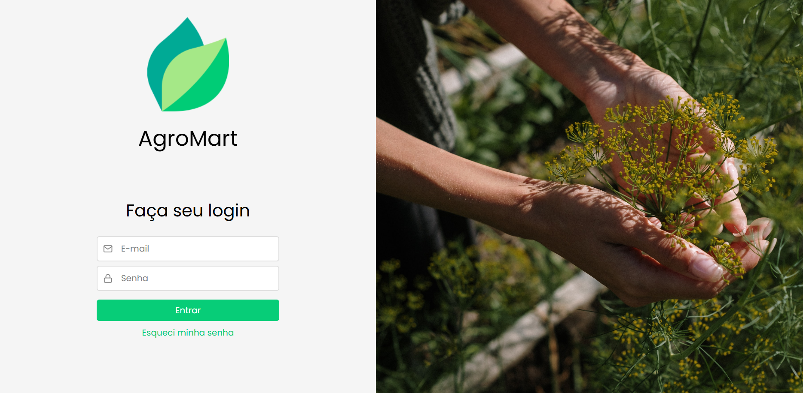
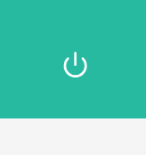
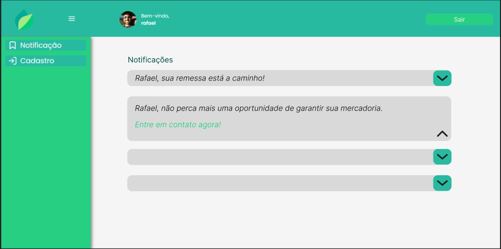

# Teste de Usabilidade Agromart com Foco em Usabilidade

## 1. Login

- Tela inicial bem simples, com campos para e-mail e senha.

- O sistema de autorização funciona bem, não permitindo login de usuários inexistentes.

- **Ponto negativo:** o link de recuperação de senha não funciona e leva a uma página que não existe.

- Boa responsividade: mesmo alterando o tamanho da tela, a área de login continua visível.

---

## 2. Tela Principal

- O botão de Logout está funcional, mesmo sem indicação visual clara.

### 2.1. Barra Lateral

- A barra lateral funciona e possui animação de abertura.

- **Problema:** não é responsiva, prejudicando usuários que não usam tela cheia.

- O botão de notificação não executa nenhuma ação ao ser clicado.

- O botão de cadastro redireciona corretamente para a tela de cadastro (avaliada no próximo tópico).

- A seção de **Novas Notificações** exibe título, descrição e um botão que responde ao clique.

- **Problema:** ao clicar, gera erro 405 (Method Not Allowed), não conseguindo realizar a ação pretendida.

---

## 3. Tela de Cadastro

- A tela possui campos para nome, e-mail e senha, além de um botão para retornar à página principal.

- O botão de envio aparenta executar a ação com feedback visual, mas **não registra o usuário** de fato.

- A validação de senha está implementada, restringindo senhas com menos de 6 dígitos.

---

## Checklist De Avaliação

| Item Avaliado                | Evidência Coletada  | Aceitação    | Prioridade | Observações / Ação de Melhoria                  |
| --------------------------- | ------------------- | --------------- | ---------- | ----------------------------------------------- |
| Link de Recuperação de Senha | Teste funcional     | ❌ Não Aceito  | Alta       | Corrigir redirecionamento                       |
| Responsividade Login         | Inspeção visual     | ✅ Aceito      | Baixa      | -                                               |
| Botão de Logout              | Teste de fluxo      | ⚠️ Parcial     | Média      | Melhorar indicação visual do botão              |
| Barra Lateral                | Inspeção responsiva | ❌ Não Aceito  | Alta       | Ajustar exibição em telas menores               |
| Botão de Notificação         | Teste funcional     | ❌ Não Aceito  | Alta       | Implementar ação de abertura de notificação     |
| Cadastro de Usuário          | Teste de fluxo      | ❌ Não Aceito  | Alta       | Registro não salva no banco                     |
| Validação de Senha           | Teste de regra      | ✅ Aceito      | Baixa      | -                                               |
| Campo Novas Notificações     | Teste funcional     | ❌ Não Aceito  | Alta       | Corrigir erro 405 na ação                       |

## Proposta de melhoria - Prototipagem

Diante dos tópicos que não passaram pelos critérios de aceitação, propomos melhorias que podem ser vistas nos frames a seguir:

### Link de Recuperação de Senha

Ao usuário clicar em "Esqueci senha" na página de login, ele será redirecionado a esse página.

### Botão de Logout

Propomos um visual mais intuitivo para o usuário poder realizar o logout.

### Botão de notificação

Propomos uma tela com as notificações reunidas e sendo possível a abertura de visualização de uma notificação.

---

### Histórico de Versões

| Versão | Data de Produção | Descrição da Alteração | Autor(es) | Revisor(es) | Data de Revisão |
|:------:|:----------------:|:----------------------:|:---------:|:-----------:|:--------------:|
| 1.0    | 06/07/2025       |Desenvolvimento de Relatorio da Usabilidade |  [Rafael Kenji](https://github.com/rafa-kenji) |[Mateus Bastos](https://github.com/MateuSansete), [Rafael Kenji](https://github.com/rafa-kenji), [Luiza Maluf](https://github.com/LuizaMaluf)| 08/07/2025|
| 1.1 | 08/07/2025 | Desenvolvimento da proposta de melhoria e registro dos portótipos | [Luiza Maluf]()| [Rafael Kenji](https://github.com/rafa-kenji)| 08/07/2025|