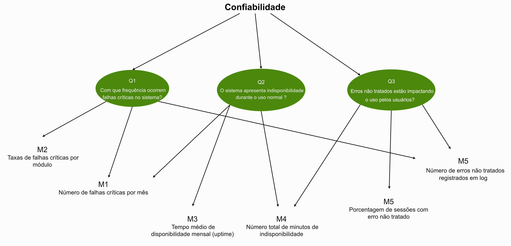
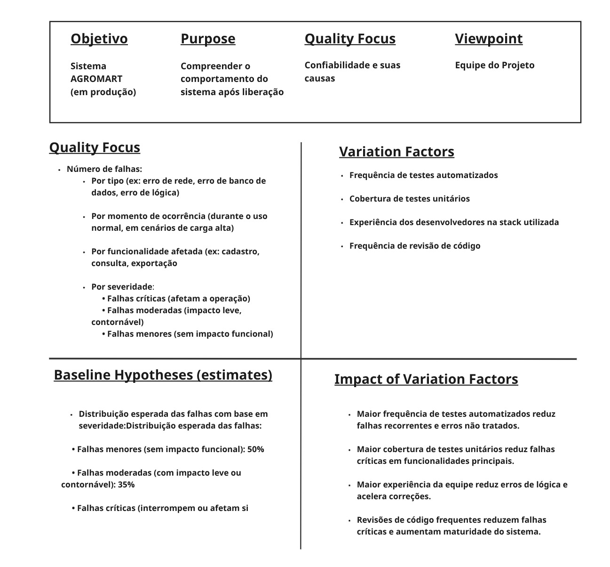

## **Fase Definição**

**Objetivo de negócio do AGROMART:**  

 Garantir que a versão Web do sistema Agromart ofereça uma experiência de navegação rápida e eficiente, mesmo em condições de rede limitadas ou em dispositivos de baixo desempenho.

| Elemento               | Descrição                                           |
|------------------------|-----------------------------------------------------|
| **Analisar**           | Agromart Web                                        |
| **Para o propósito de**| Garantir a confiança                                |
| **Com respeito a**     | Confiabilidade                                      |
| **Do ponto de vista de**| Equipe de desenvolvimento e suporte técnico       |
| **No contexto de**     | Disciplina                                          |

---

## **Questões Objetivo de Medição 1:  Confiabilidade**
 
**Q1 – Maturidade**
**Pergunta:** Com que frequência ocorrem falhas críticas no sistema, considerando sua estabilidade em operação contínua?

**Hipótese Q1:** O número de falhas críticas será inferior a 2 por mês.

 

**Q2 – Disponibilidade**
**Pergunta:** O sistema mantém um tempo de atividade adequado durante o uso normal?

**Hipótese Q2:** O tempo de disponibilidade mensal será superior a 99,8%.

 
**Q3 – Tolerância a Falhas**
**Pergunta:** O sistema lida adequadamente com erros não tratados sem interromper a experiência do usuário?

**Hipótese Q3:** Menos de 5% das sessões de usuários resultarão em erros não tratados.

 
**Q4 – Recuperabilidade**
**Pergunta:** Após uma falha, o sistema recupera seu funcionamento de forma eficaz, restaurando o estado funcional e os dados afetados?

**Hipótese Q4:** 95% das falhas serão recuperadas em até 5 minutos, com mínima ou nenhuma perda de dados.

---

## **Diagrama GQM**

A seguir a figura 1 detalha o diagrama de Questões e métricas do **GQM**.

<b>Figura 1</b> - GQM 

---

 

## **Abstraction Sheets**

A figura 2 mostra o nosso Abstraction Sheets com os nosso propósito, foco, qualidade, ponto de vista,
foco na qualidade, baseline, fatores de variação e impactos.

<b>Figura 2</b> -Abstraction Sheets  

---

 

## Tabela de contribuição:

| Matrícula   | Nome Completo                                                   | Contribuição (%) |
|-------------|------------------------------------------------------------------|------------------|
| 211062240   | [Mateus Bastos](https://github.com/MateuSansete)                 | 50              |
| 190044128   | [Rafael Kenji Taira](https://github.com/rafa-kenji)              | 11.5            |
| 222006383           | [Rafael Matuda](https://github.com/rmatuda)              | 11.5            |
| 211031664   | [Catlen Cleane](https://github.com/catlenc)                      | 11.5            |
| 221008294   | [Luiza Maluf](https://github.com/LuizaMaluf)                     |     15.5        |

---

### Histórico de Versões

| Versão | Data de Produção | Descrição da Alteração | Autor(es) | Revisor(es) | Data de Revisão |
|:------:|:----------------:|:----------------------:|:---------:|:-----------:|:--------------:|
| 1.0    | 01/06/2025       | Desenvolvimento da aba GQM | [Mateus Bastos](https://github.com/MateuSansete)  | [Catlen Cleane](https://github.com/catlenc), [Rafael Matuda](https://github.com/rmatuda)| 01/06/2025 |
| 1.1    | 03/06/2025       | Adição de links para arquivos PDF no documento GQM | [Mateus Bastos](https://github.com/MateuSansete) | [Catlen Cleane](https://github.com/catlenc),[Rafael Matuda](https://github.com/rmatuda) | 03/06/2025 |

