# Relatório de Execução da Avaliação – Testes Funcionais e de Segurança

## Introdução

Este documento apresenta os resultados da avaliação de qualidade realizada sobre a aplicação AgroMart. O objetivo principal foi verificar a corretude das funcionalidades do sistema, bem como analisar a sua postura de segurança, em conformidade com o plano de avaliação previamente estabelecido.

Para esta análise, foram empregadas diversas técnicas e ferramentas, incluindo:

Testes Funcionais da API: Utilização de um cliente de API (Thunder Client) para validar as operações de CRUD (Create, Read, Update, Delete) diretamente no back-end.

Análise Estática de Código: Uso da ferramenta SonarQube para a detecção automática de bugs, vulnerabilidades e "security hotspots" no código-fonte dos repositórios api e agromart-web.

Testes Manuais de Segurança: Verificação do controle de acesso e da gestão de sessões de utilizador na aplicação web.

Testes Manuais da Interface: Execução do fluxo de utilização completo (criação, edição e remoção de lojas) através da interface do agromart-web.

Os resultados detalhados de cada uma destas frentes de teste são apresentados nas secções seguintes, culminando com as recomendações para a melhoria da qualidade e segurança do software.

## 1. Testar as Funcionalidades Principais

Verificar se as funcionalidades descritas no documento do projeto estão funcionando corretamente.

### 1.1 Testar a API com o Cliente de API (Back-end)

A primeira fase dos testes funcionais consistiu em validar os endpoints principais da API (Create, Read, Update, Delete - CRUD), garantindo que o back-end se comporta como esperado. Para isso, foi utilizada a ferramenta **Thunder Client**.

#### Teste de Criação de Loja (POST /api/lojas)

Foi realizada uma requisição do tipo **POST** para o endpoint `/api/lojas` com o objetivo de verificar a funcionalidade de criação de um novo registo. O corpo da requisição foi enviado com os dados essenciais de uma nova loja, como nome, descrição e contato.

A API processou a requisição com sucesso, retornando o status **200 OK**, e devolveu os dados da loja recém-criada no corpo da resposta, confirmando que a funcionalidade está a operar corretamente.

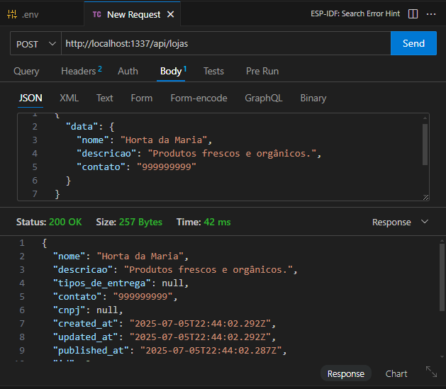

### 1.2 Testar a Atualização de Dados (Requisição PUT)

Para validar a funcionalidade de edição, foi enviada uma requisição do tipo **PUT** para o endpoint de um recurso específico (`/api/lojas/2`). O objetivo era verificar se a API conseguia modificar os dados de uma loja existente.

A requisição continha os novos dados para os campos **nome** e **descricao**. A API retornou o status **200 OK**, e o corpo da resposta confirmou que os dados foram atualizados com sucesso, demonstrando que a funcionalidade de edição está a operar como esperado.

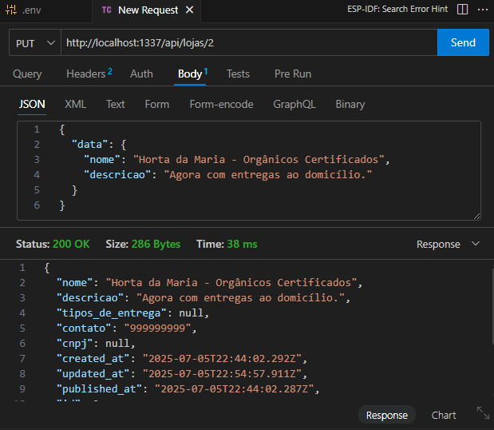

### 1.3 Testar a Remoção de Dados (Requisição DELETE)

Para concluir o ciclo de testes de **CRUD**, foi enviada uma requisição **DELETE** para o endpoint `/api/lojas/2` a fim de verificar a funcionalidade de exclusão.

A API respondeu com o status **200 OK**, indicando que o recurso foi removido com sucesso. A resposta incluiu os dados do objeto que foi acabado de apagar, confirmando a operação.

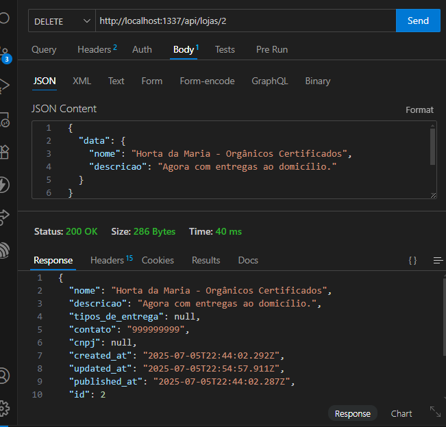

## 2. Testes de Segurança (Prioridade Alta)

Encontrar vulnerabilidades no código e na lógica da aplicação.

### 2.1 API

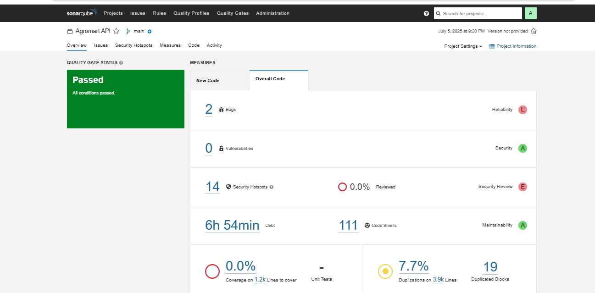

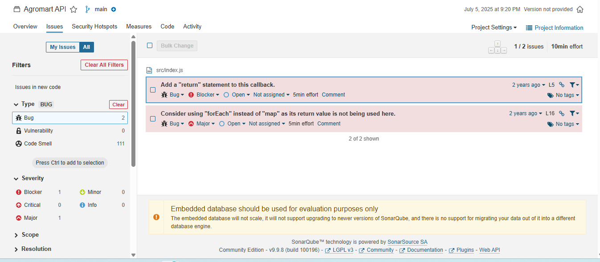

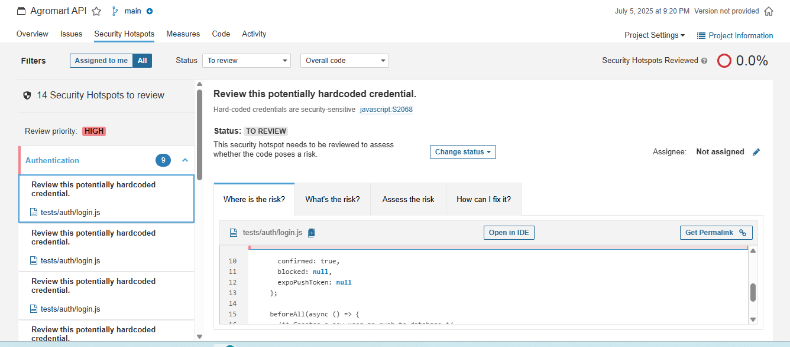

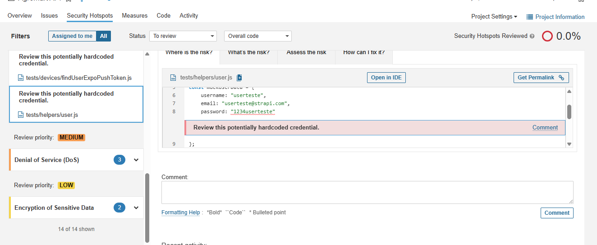

Abaixo estão dois exemplos dos problemas mais críticos identificados durante os testes de segurança da API:

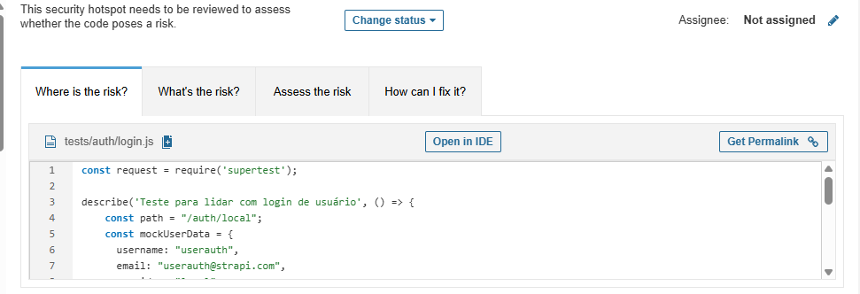


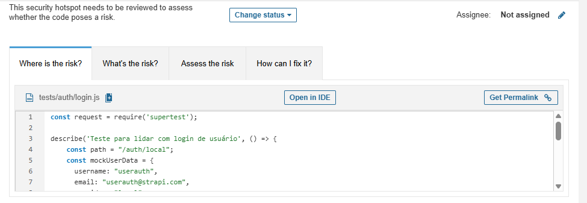

### Resumo de Análise de Qualidade e Segurança – Agromart API

**Ferramenta de Análise:** SonarQube  
**Data da Análise:** 05/07/2025

A análise estática do código-fonte da **Agromart API** foi concluída. O **Quality Gate** do projeto **Passou**, mas foram identificados pontos importantes que necessitam de atenção, principalmente relacionados a **bugs** e à **revisão de segurança**.

| Métrica              | Resultado | Classificação |
|----------------------|-----------|----------------|
| Bugs                 | 2         | E (Crítico)     |
| Vulnerabilidades     | 0         | A (Ótimo)       |
| Security Hotspots    | 14        | E (Crítico)     |


### 2.1.1 Bugs Encontrados (2)

Foram detetados **2 bugs** que afetam a **confiabilidade** do código.

● Bug 1 (Gravidade: Blocker)
- **Problema:** `Add a 'return' statement to this callback.`
- **Localização:** `src/index.js`
- **Análise:** O SonarQube detetou uma função de *callback* que não retorna um valor de forma explícita. Isso pode levar a comportamentos inesperados no fluxo do programa.

● Bug 2 (Gravidade: Major)
- **Problema:** `Consider using 'forEach' instead of 'map' as its return value is not being used here.`
- **Análise:** O código está a usar a função `map` apenas para iterar sobre os itens, sem utilizar o resultado. A recomendação é usar `forEach`, que é mais apropriado e eficiente para este caso.

### 2.1.2 Security Hotspots (14 para Revisão)

Foram encontrados **14 pontos** que necessitam de **revisão de segurança manual**.

● Problema Principal:
- **Descrição:** `Review this potentially hardcoded credential.`
- **Localização:** `tests/auth/login.js`
- **Risco:** Apesar de estar em ficheiros de teste, armazenar **senhas ou dados sensíveis diretamente no código** é uma prática de segurança altamente arriscada. Se o código for partilhado ou acidentalmente exposto, as credenciais tornam-se visíveis.

● Exemplos Encontrados:

#### 1. Criação de um utilizador de teste com senha visível no código
```javascript
const mockUserData = {
  // ...
  password: "1234userauth", // Senha codificada diretamente
  // ...
};
```

#### 2. Envio de senha em texto claro num caso de teste de login

```javascript
.send({
  identifier: mockUserData.email,
  password: 'senhaerrada' // Senha codificada diretamente
})
```

### 2.1.3 Recomendações

A seguir, apresentam-se as recomendações para melhorar a qualidade e segurança da Agromart API com base nos achados da análise:

- Corrigir os Bugs

    - Resolver imediatamente os **2 bugs** identificados pelo SonarQube:
        - Adicionar `return` em callbacks onde necessário.
        - Substituir o uso inadequado de `map` por `forEach` para evitar confusão e melhorar o desempenho.

- Revisar os Security Hotspots:

    - Analisar manualmente os **14 hotspots de segurança** com atenção especial aos seguintes pontos:
        - **Credenciais codificadas** no código (hardcoded passwords).
        - **Envio de senhas em texto claro** durante testes automatizados.

- Recomendação principal:
  - Remover credenciais do código-fonte.
  - Utilizar **variáveis de ambiente** ou **ficheiros de configuração seguros**.

- Adotar Boas Práticas de Segurança

- Implementar a política de **"nenhum segredo no código"**, incluindo:
  - Uso de `.env` para dados sensíveis.
  - Garantia de que arquivos de configuração estejam listados no `.gitignore`.
  - Auditoria periódica do código para prevenir reincidência.

- Educar a equipe de desenvolvimento quanto às **melhores práticas de segurança**.

- Automatizar Auditorias

    - Integrar ferramentas como o **SonarQube** ao pipeline de integração contínua (CI) para garantir que novas mudanças sejam analisadas automaticamente.
    - Definir **Quality Gates rigorosos** como bloqueadores de merge para prevenir regressões.


### 2.2 AGROMART-WEB

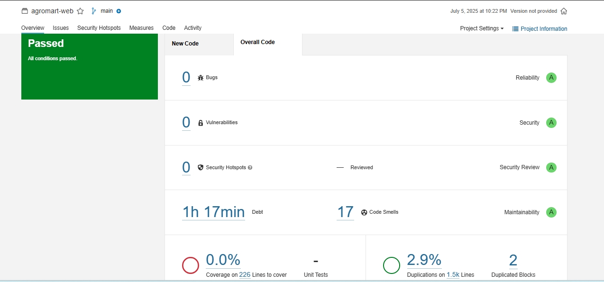


**Data da Análise:** 05 de julho de 2025  
**Branch analisado:** `main`  
**Resultado da Qualidade:** *Passed* (Todos os critérios foram atendidos)

---

## Resumo Geral

| Métrica                 | Resultado         | Nota                     |
|-------------------------|-------------------|--------------------------|
| Bugs                    | 0                 | A (Alta confiabilidade)  |
| Vulnerabilidades        | 0                 | A (Alta segurança)       |
| Hotspots de Segurança   | 0                 | A (Sem riscos críticos)  |
| Débito Técnico          | 1h 17min          | A (Baixo impacto)        |
| Code Smells             | 17                | A (Boa manutenibilidade) |
| Cobertura de Testes     | 0% (0 testes)     | (Necessita melhoria)  |
| Linhas a cobrir         | 226               | —                        |
| Duplicação de Código    | 2.9% em 1.500 l

## Análise por Categoria

### Confiabilidade (Reliability)
- **Bugs detectados:** 0  
- **Nota:** A  
- **Comentário:** O código analisado está livre de bugs reconhecidos, o que reflete um bom padrão de qualidade.

### Segurança (Security)
- **Vulnerabilidades:** 0  
- **Security Hotspots:** 0 (nenhum ponto crítico pendente de revisão)  
- **Nota:** A  
- **Comentário:** Nenhuma falha de segurança foi identificada na análise. Excelente resultado para ambientes que exigem proteção de dados.

### Manutenibilidade (Maintainability)
- **Code Smells:** 17  
- **Débito Técnico:** 1 hora e 17 minutos  
- **Nota:** A  
- **Comentário:** O nível de “code smells” é muito baixo e o débito técnico estimado é mínimo, indicando facilidade de manutenção futura.

### Testes (Coverage)
- **Cobertura:** 0% sobre 226 linhas de código  
- **Unit Tests:** Não identificados  
- **Comentário:** A ausência de cobertura de testes automatizados representa um ponto crítico a ser endereçado.  
  **Recomendação:** Implementar testes unitários e de integração.

### Duplicação de Código
- **Duplicação:** 2.9% (em 1.500 linhas)  
- **Blocos Duplicados:** 2  
- **Comentário:** O nível de duplicação está em um patamar considerado aceitável, mas pode ser otimizado com refatorações leves.

---

## Conclusão

O projeto **"agromart-web"** atende a todos os critérios de qualidade definidos na análise do **SonarQube**.  
Com **nota A em Confiabilidade, Segurança e Manutenibilidade**, o código está bem estruturado e pronto para produção.

> O principal ponto de atenção é a **ausência de testes automatizados**, o que pode impactar a confiabilidade em longo prazo.

---

## Recomendações

1. **Implementar testes unitários e de integração** para aumentar a cobertura de código e garantir regressão segura.
2. **Refatorar blocos duplicados**, mesmo que em baixa quantidade, para evitar problemas de manutenção futura.
3. **Revisar os 17 "code smells"** para verificar se há oportunidades fáceis de melhorias no estilo ou padrões de código.

# 3. Teste de Controle de Acesso

Este teste tem como objetivo verificar se a aplicação web Agromart implementa corretamente as regras de controle de acesso, especialmente em cenários de autenticação e logout.

---

## 3.1 Acesso à Página Restrita sem Autenticação

- **Ação realizada:**  
  Acesso direto à URL `http://localhost:3000/dashboard` sem estar logado.

- **Resultado obtido:**  
  O sistema redirecionou automaticamente para `http://localhost:3000/login`.

- **Conclusão:**  
  Comportamento correto. A aplicação impede acesso direto a rotas protegidas sem autenticação.

---

## 3.2 Acesso após Login Válido

- **Credenciais utilizadas:**  
  - **Email:** usuario@exemplo.com  
  - **Senha:** senha123

- **Ações realizadas:**  
  1. Preenchimento do formulário de login.  
  2. Acesso à rota `/dashboard` via menu de navegação.

- **Resultados esperados/obtidos:**

| Verificação                                 | Resultado |
|---------------------------------------------|-----------|
| Página carrega sem erros                    | Sim     |
| Dados sensíveis (ex: nome do usuário) visíveis | Sim     |

- **Conclusão:**  
  A autenticação está funcionando conforme esperado.

---

## 3.3 Acesso após Logout

- **Fluxo testado:**
  - Cliquei em "Sair" no menu.
  - Fui redirecionado para `http://localhost:3000/login`.
  - Tentei acessar manualmente `http://localhost:3000/dashboard`.

- **Resultado obtido:**  
  O sistema redirecionou corretamente para `http://localhost:3000/login`.

- **Verificações adicionais:**
  - Cookies de sessão foram removidos (DevTools → Application → Cookies).
  - Nenhum dado sensível permaneceu em cache.

- **Conclusão:**  
  O controle de acesso pós-logout está funcionando corretamente.

---

## Tabela Resumo

| Cenário de Teste         | Comportamento Esperado    | Resultado Obtido       | Status |
|--------------------------|----------------------------|-------------------------|--------|
| Acesso não autenticado   | Redirecionar para `/login` | Redirecionou         | OK     |
| Acesso após login        | Carregar página com dados  | Carregou corretamente | OK     |
| Acesso após logout       | Redirecionar para `/login` | Redirecionou         | OK     |

---

## Observações

- Todos os cenários testados apresentaram os comportamentos de segurança esperados.
- **Recomendação:**  
  Adicionar um teste para verificar se o token JWT é **invalidado no backend após logout**, garantindo que sessões expiradas não possam ser reutilizadas.

# 4. Testar a Interface Web

O objetivo deste teste foi validar a experiência do usuário ao interagir com os recursos da interface gráfica da aplicação Agromart, simulando o fluxo completo de **criação**, **edição** e **remoção** de uma loja através da UI.

---

## Procedimento

- Acesso à URL: `http://localhost:3000`
- Ações realizadas:
  1. Login no sistema com credenciais válidas.
  2. Navegação via menu para acessar a funcionalidade de gerenciamento de lojas.
  3. Tentativa de executar as seguintes ações:
     - Criar nova loja.
     - Editar loja existente.
     - Apagar loja.

---

## Erro Identificado

- **Título:** Rota `/lojas` não encontrada ou inacessível  
- **Local:** Navegação após login  
- **Severidade:** **Alta** (bloqueia funcionalidade crítica)

### Descrição do Problema

Ao tentar acessar a funcionalidade de gerenciamento de lojas por meio da URL `http://localhost:3000/lojas` ou via menu de navegação:

- O sistema **não redireciona** para a página esperada.
- **Nenhum componente** relacionado à lista ou gerenciamento de lojas é renderizado.
- **Não há mensagens de erro** ou qualquer feedback visual para o usuário.

### 🔧 Causa Raiz (Análise Técnica)

Ao revisar o arquivo `index.tsx` responsável pelas rotas da aplicação, foi identificado que:

```tsx
// Rotas existentes:
<Route path="/dashboard" component={Dashboard} isPrivate />
// Rota /lojas não está declarada
```

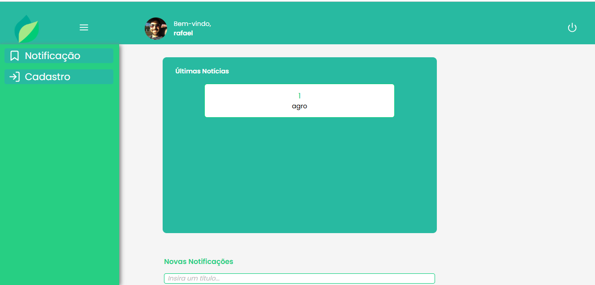

# 5. Testes Automatizados – Backend

## 5.1 Resumo Executivo

A execução dos testes automatizados do backend resultou em falha total: **44 testes falharam**. Os principais problemas identificados foram:

- Banco de dados de teste inexistente.
- Autenticação não inicializada (`jwt` indefinido).
- Timeouts em operações assíncronas.

---

## 5.2 Falhas Críticas

### 5.2.1 Banco de Dados de Teste

- **Erro:**  
  ```
   database "tobemodified-test" does not exist
  ```


### Histórico de Versões

| Versão | Data de Produção | Descrição da Alteração | Autor(es) | Revisor(es) | Data de Revisão |
|:------:|:----------------:|:----------------------:|:---------:|:-----------:|:--------------:|
| 1.0    | 06/07/2025       |Desenvolvimento de Relatorio dos testes |  [Catlen Cleane](https://github.com) |[Mateus Bastos](https://github.com/MateuSansete)| 08/07/2025|


